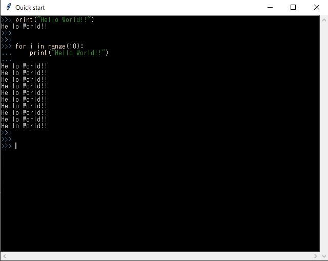
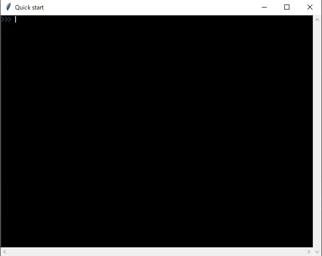

# tkinter-console (￣∀￣)ﾆﾔﾘ

  

The `tkinter_console` is a console utility as widgets.

`tkinter_console` includes below console widgets
  - Python interactive console
  - Log console
   
These console were created using `tkinter`.


## Demo
- **Python interactive console**

  


<br>

- **Log Console**

  

<br>


<br><br>


## Table of Contents
- [tkinter\_console](#tkinter_console-ﾆﾔﾘ)
  - [Demo](#Demo)
  - [Installation](#installation)
    - [Environment](#environment)
  - [Documentation](#documentation)
    - [Python interactive console](#python-interactive-console)
      - [1. Quick start](#1-quick-start)
      - [2. Customization](#2-customization)
        - [2.1 How to customize a config](#21-how-to-customize-a-config)
        - [2.2 How to use the customized config](#22-how-to-use-the-customized-config)
    - [Log Console](#log-console)
      - [1. Quick start](#1-quick-start-1)
      - [2. Other samples](#2-other-samples)
  - [License](#license)


<br><br>

## Installation

### Environment
- Widows10
- Python 3.10.8
  
My python environment is the `Python 3.10.8`, but maybe it can be executed any minor version.
```bash
pip install git+https://github.com/BlackHatD/tkinter-console.git
```

<br><br>

## Documentation
- **console** (Python Interactive Console)
    -  [ ] [`PyConsole`](./tkinter_console/console/pyconsole.py) : base class
    -  [x] [`PyConsoleEx`](./tkinter_console/console/pyconsole_ex.py) : extended `PyConsole` class
<br>

- **log_console**
    - [ ] [`LogConsoleFrame`](./tkinter_console/log_console/frames/console.py): base class
    - [ ] [`LogSelectorFrame`](./tkinter_console/log_console/frames/selector.py): base class
    - [x] [`LogConsoleExFrame`](./tkinter_console/log_console/frames/console_ex.py): mixes `LogSelectorFrame` and `LogConsoleFrame`


basically use checked.  
the not checked class of samples are [here](./tests), if you want to use it.

<br>

### Python interactive console

#### 1. Quick start

```python
# -*- coding:utf-8 -*-
import tkinter as tk
from tkinter_console import PyConsoleEx

if __name__ == '__main__':
    root = tk.Tk()
    root.title('PyConsoleEx Test01')

    # create an instance
    console = PyConsoleEx(root, locals())
    console.init()  # initialize
    console.pack()  # pack

    # it's also ok
    # console.init().pack()

    root.mainloop()
```




- **Note:**  
  If you generate an infinite loop, press **`ctrl`**+**`c`** key.  
  like the below code...
  ```python
  while True:
    # something...
  ```

  **`ctrl`**+**`c`** key works are
  - initialized prompt on the current line (default)
  - kill the thread, and initialized prompt (when the entered command is being executed)
  
<br><br>

#### 2. Customization

##### 2.1 How to customize a config
generate a config at first  
(generated in the current directory as `settings/console.json`)
```python
# -*- coding:utf-8 -*-
from tkinter_console import PyConsoleEx

if __name__ == '__main__':
    # generate a config at first
    PyConsoleEx.generate_config()

    # customize the generated config
```
##### see [default config](./tkinter_console/console/settings/console.json)
<br>


<details><summary><b>Customize Console</b></summary><br>


  - console area
    ```python
    "console": {...}
    ```

    - kwargs area
      ```json
      "kwargs": {
        "foreground": "silver",
        "background": "black"
      }
      ```

      `kwargs` is the **`Text`**'s **`configure`** kwargs

      <br><br>

    - prompt area
      ```json
      "prompt": {
          "normal": ">>> ",
          "wait": "... ",
          "kwargs": {
              "foreground": "steelblue"
          }
      }

      ```

      `normal` and `wait` are prompted string.
      - `normal`
          is normal state

      - `wait`
          is wait state, if an inputted command includes `:` at the last.
      <br>


      `kwargs` is the **`Text`**'s **`tag_configure`** kwargs 

      <br>

      - **NOTE**:  
          Don't edit key, and don't add anything except in `kwargs` values
      <br>


    <br>

    - std area
      ```json
      "std": {
        "stdin": {
          "kwargs": {}
        },
        "stdout": {
          "kwargs": {}
        },
        "stderr": {
          "kwargs": {"foreground": "darkred"}
        },
        "traceback": {
          "kwargs": {}
        }
      }
      ```

      `stdin`, `stdout`, `stderr`, `traceback` settings  
      ex) If `stderr` occurred, displayed in `darkred` in this case.  
      <br>

      `kwargs` is the **`Text`**'s **`tag_configure`** kwargs 

      <br>


      - **NOTE**:  
          Don't edit key, and don't add anything except in `kwargs` values
      <br>
</details>
<br>

<details><summary><b>Customize Syntax Highlighting</b></summary><br>

  - syntax area
    ```python
      "syntax": {...}
    ```
    - builtins area

      ```json
      "builtins": {
        "kwargs": {
          "foreground": "peachpuff"
        }
      }
      ```
      if a builtin's keyword is input, it's highlighted in `peachpuff`, in this case.
      <br>

      - **NOTE**:  
        Don't edit key, and don't add anything except in `kwargs` values
    <br>

    - normal area
      ```python
      "normal": {...}
      ```

      In this area, don't check as regex
      <br>

      - format
        ```python
        "target_keyword": {
          "kwargs": {}
        }
        ```
        - **NOTE**:  
          `target_keyword` is anything OK.  
          Don't add other keys except in `kwargs` values.  
          <br>

          If set builtin's key, it' overridden (not updated) this settings.  
          In this case `"kwargs": {}`, displayed in default color.  

      <br>

      - example
        ```json
        "def": {
          "kwargs": {
            "foreground": "deepskyblue"
          }
        }
        ```

    <br><br>
      
    - regex area
      ```python
      "regex": {...}
      ```
      In this area, check as regex
      <br>

      - format
        ```python
        "target_keyword": {
          "kwargs": {
            "pattern": ""
          }
        }
        ```
        - **NOTE**:  
          `target_keyword` is anything OK.  
          In the `kwargs`, **need** `pattern` key, which is an original key.   
          Don't add other keys except in `kwargs` values.

          <br>

      - example
        ```json
        "double_quotation": {
          "kwargs": {
            "pattern": "\".*?\"",
            "foreground": "forestgreen"
          }
        }
        ```
    <br>

</details>

<br>

sample


<br><br>


##### 2.2 How to use the customized config

```python
# create an instance
console = PyConsoleEx(master, locals())

# load config
console.load_config('./settings/console.json')
```

<br><br>

### Log Console
#### 1. Quick start
<details><summary><b>source</b></summary>

  ```python
  # -*- coding:utf-8 -*-
  import tkinter as tk
  from tkinter import ttk
  from logging import (
      getLogger
      , DEBUG
      , INFO
  )

  # my modules and packages
  from tkinter_console.log_console import LogConsoleExFrame

  if __name__ == '__main__':
      # create a logger object and set logger level
      logger = getLogger(__name__)
      logger.setLevel(DEBUG)

      # define loglog method for using button
      def loglog():
          logger.debug('debug message')
          logger.info('info message')
          logger.warning('warn message')
          logger.error('error message')
          logger.critical('critical message')


      # create root object
      root = tk.Tk()
      root.title('Quick start')

      # create console frame
      console_frame = LogConsoleExFrame(root, logger, level=INFO)

      # set log format
      console_frame.log_formatter = '%(asctime)s\t[%(levelname)-8s]\t%(name)s\t%(filename)s\t%(funcName)s:%(lineno)d\t%(message)s'

      # initialize console frame at first
      console_frame.init().pack()

      # for test
      button_frame = tk.LabelFrame(root, text='LOGLOG', foreground='white', background="blue", height=20, pady=5)
      button_frame.pack(fill=tk.BOTH)
      button = ttk.Button(button_frame, text="LOGGING", command=loglog)
      button.pack(fill=tk.X, expand=True)

      # run loglog function at first
      loglog()


      # mainloop
      root.mainloop()
  ```
</details><br>


<br><br>


#### 2. Other samples
- [Enabled expand button](./docs/log_console/02_enabled_expand.py)
- [Threading Sample](./docs/log_console/03_threading_sample.py)


<br><br>

## License
[GNU GENERAL PUBLIC LICENSE Version 2](./LICENSE)


